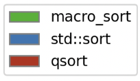
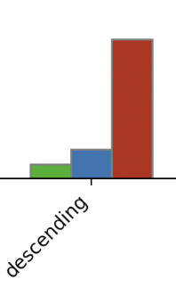
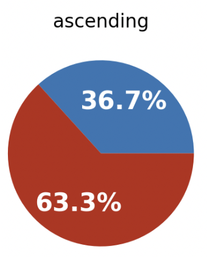
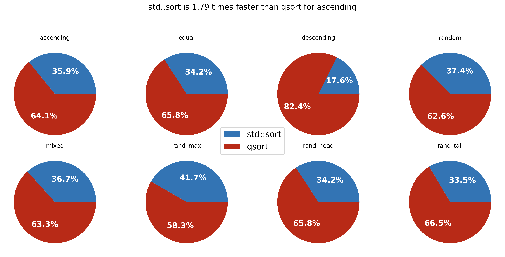
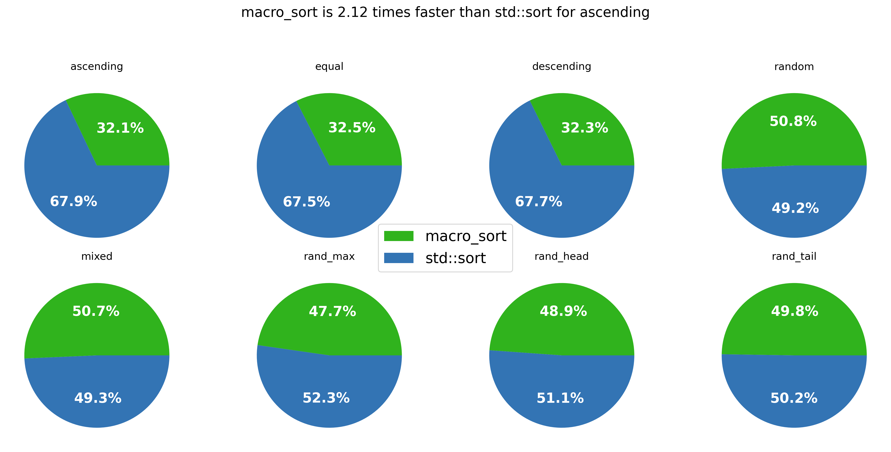

## A comparison of macro_sort vs std::sort vs qsort
A comparison of this sort to qsort and std::sort follows.

std::sort is almost twice as fast as qsort in most measures and is over 5x faster than qsort when data is descending in many tests.  

std::sort achieves superior performance by
* inlining the comparison
* inlining the type (instead of working directly with bytes)

It also has better `safety` as the qsort works with void pointers instead of type based arrays.  Additionally, qsort expects the compare function to have two void pointers.  std::sort expects the compare function to reference the actual types.

std::sort uses introsort, a combination of quick sort, insertion sort, and heap sort to ensure performance and prevent worst case scenarios.  Some implementations use the Dutch National Flag algorithm which partitions arrays into a left (less than), right (greater than), and pivot (equal).  The Dutch National Flag algorithm differs from others in as much as the pivot is an array of all equal values as opposed to a single value and the left hand side contains all values less than as opposed to all values less than or equal.

This document has a series of bar graphs which will compare 3 sort types listed in the legend on the upper right corner.  The legends are color coded.

A sample legend



The bar graph makes it easy to see how the 3 sort types stack up against each other.

A sample of the bar graph 



To test sort, there are a number of tests where arrays are pre-ordered before sorting.  

The bar graph has a caption at the bottom indicating

* number of items being sorted
* number of times the sort is repeated (if it is repeated more than once)
* the size of each item in bytes

In all cases, the tests for each sort algorithm use identical sets.  For example, the random array presents the same array of random values to std::sort, macro_sort, and qsort. 

The tests shown in the graphs are below.

## ascending

Tests sorting data that is already sorted

## equal

Tests sorting data where all items are equal

## descending

Tests sorting data where all items are in reverse or descending order

## random

This tests sorting data that is randomized.  For all random methods, the data is randomized differently for each time the array is repeated.  For example, if the array is 1 million items and repeated 100 times, the 100 arrays will have different random values. 

## ascending_random

This tests first sorting that is first sorted in an ascending fashion.  Next, the N random swaps are applied to the array where N is equal to 25% of the number of items.

## rand_max

This tests random values between 0 and 99.

## rand_head

This tests random values in the first 25% of the array and the rest of the array being sorted.

## rand_tail

This tests random values in the last 25% of the array and the rest of the array being sorted.

In addition to the bar graph, I've added pie charts to aid in side-by-side comparisons.  Less is more and having a percentage below 50% means that an algorithm is faster than the other algorithm.  Dividing the higher percentage by the lower percentage provides an indication of how many times faster the algorithm with the smaller percentage is than the algorithm with the higher percentage.  For example,



The pie chart above shows that for ascending the blue color is (63.3/36.7) or 1.72 times faster than the red color.  The margin of error for these graphs is around 1%.


For each test, I've indicated how to repeat the test.  To build the tests, follow the instructions for setting up the python environment and running `make` in the [README.md](README.md).  `make install` is not necessary.

From the root of the repo
```bash
cd build/examples/speed-test
make
```

The programs first parameter is the number of items in an array to be sorted and the number of times to repeat the sort.  This allocates (the number of items) X (the number of reps) X (the size of each item) X 2 bytes to run.  My laptop is a 2020 MacBook Pro with 32G of RAM.

```bash
./speed_test_final 1000000 100
```

After running the various speed_test programs, `macro-plot` can be run to generate `matplotlib` graphs in python.  

* `macro-plot.py` - creates a bar graph comparing 3 sorts.  
* `macro-plot2.py` - creates a series of pie charts comparing the first 2 sorts.  
* `macro-plot2.py 1` - creates a series of pie charts comparing the first and last sort.
* `macro-plot2.py 2` - creates a series of pie charts comparing the second and last sort.

```bash
macro-plot.py
macro-plot2.py 1
macro-plot2.py 2
macro-plot2.py
```

This compares the fastest version of macro_sort vs the fastest version of std::sort vs qsort.


Comparing std::sort vs qsort


Comparing macro_sort vs qsort


Comparing macro_sort vs std::sort


## Takeaways

* qsort is significantly less efficient than std::sort or macro_sort
  * macro_sort is almost 10 times faster than qsort for the descending case
* macro_sort performs significantly better for the ascending and descending case
* macro_sort performs better than std::sort when the set is randomized, but has a lot of repeated values
* std::sort performs slightly better when the set is completely randomized without repeated values
* macro_sort has similar performance with user defined compare functions and inlined compare functions
* macro_sort has significantly better performance than std::sort when std::sort uses the extra compare function

Macro_sort provides a viable alternative to std::sort for C and C++ programming.  Overall, macro_sort's approach to ascending and descending should be adopted by std::sort.

Comparing macro_sort with a user provided function that is inlined into the sort vs std::sort with a user provided sort and C's qsort.  Both qsort and std::sort perform much worse than macro_sort. 
```bash
./speed_test 1000000 100
macro-plot.py
macro-plot2.py 1
macro-plot2.py
```


One reason that macro_sort likely outperforms the std::sort function is because the compare method isn't being inlined since it is being passed as an argument to std::sort.  macro_sort supports creating functions which expect user provided functions.  The test below compares macro_sort with the user function inlined vs being passed as an argument vs std::sort.  There is almost no difference between the two versions of macro_sort in this test.
```bash
./speed_test2 1000000 100
macro-plot.py
macro-plot2.py
```


macro_sort with compare inlined vs std::sort with the less operator defined vs a user provided compare function.  The less operator shows significant improvement over the user provided comparison function.  It also slightly outperforms macro_sort on the random measure.  However, macro_sort performs much better for ascending and descending.

```bash
./speed_test_class 1000000 100 
macro-plot.py
macro-plot2.py
```


Comparing macro_sort using the less operator vs the user specified inlined compare function.  There is a very slight improvement in performance.
```bash
./speed_test_class2 1000000 100 
macro-plot.py
macro-plot2.py
```


Finally, the larger the item size, the less the difference between the algorithms.  There is still a notable difference for the ascending and descending cases.

```bash
./speed_test_class3 1000000 100 
macro-plot.py
macro-plot2.py
```


