## A comparison of macro_sort vs std::sort vs qsort
A comparison of this sort to qsort and std::sort follows.

starting from root directory (assuming package was built - see last section)
```bash
cd build/examples/speed-test
make
```

After running the various speed_test programs, `macro-plot` can be run to generate `matplotlib` graphs in python.  There are two versions.  `macro-plot.py` generates a bar graph comparing 3 sorts.  `macro-plot2.py` generates a graph with a series of pie charts comparing the first 2 sorts.  `macro-plot2.py 1` compares the first and the last sort.  `macro-plot2.py 2` compares the second and the last sort.

```bash
./speed_test_final 1000000 100
macro-plot.py
macro-plot2.py 1
macro-plot2.py 2
macro-plot2.py
```

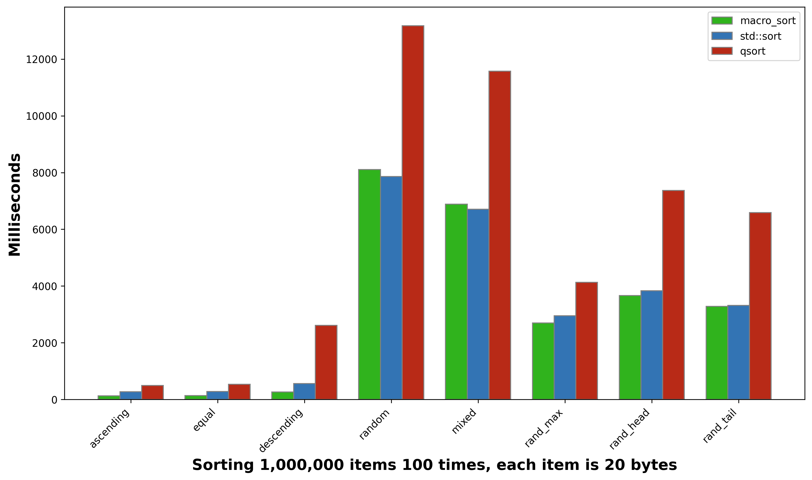

The pie charts show how one method compares to another.  Less is more.  A method is faster if it falls below 50%.  They are equal if both are 50%.  To find how many times faster one is than the other, divide the two.  For example, in the chart below, macro_sort is 9.53 times faster than qsort for descending!  qsort isn't competitive on any measure and because of that won't be measured moving forward.
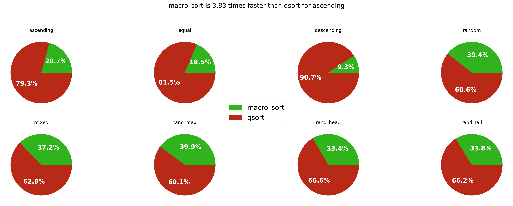

The goal of macro_sort is to be equal to _or better than the std::sort and provide a C alternative to the C++ sort.  


```
Sorting 1,000,000 items 100 times, each item is 20 bytes

       test name          macro_sort      std::sort          qsort
       ascending             125.672        277.277        477.766
           equal             274.872        285.322        566.583
      descending             270.166        550.867       2657.260
          random            8348.023       8108.391      13408.144
ascending_random            7011.610       6899.970      11928.707
        rand_max            2770.218       3092.498       4298.485
       rand_head            3777.430       3901.969       7466.813
       rand_tail            3362.192       3390.228       6792.457
```


Comparing macro_sort with a user provided function that is inlined into the sort vs std::sort with a user provided sort and C's qsort.  Both qsort and std::sort perform much worse than macro_sort. 
```bash
./speed_test 1000000 100
macro-plot.py
macro-plot2.py 1
macro-plot2.py
```

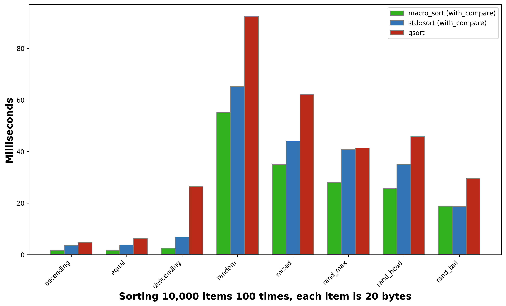

The pie charts show how one method compares to another.  Less is more.  A method is faster if it falls below 50%.  They are equal if both are 50%.  To find how many times faster one is than the other, divide the two.  For example, in the chart below, macro_sort is 9.53 times faster than qsort for descending!  qsort isn't competitive on any measure and because of that won't be measured moving forward. 
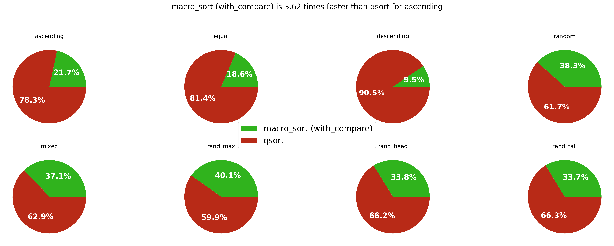

The goal of macro_sort is to be equal to _or better than the std::sort and provide a C alternative to the C++ sort.  
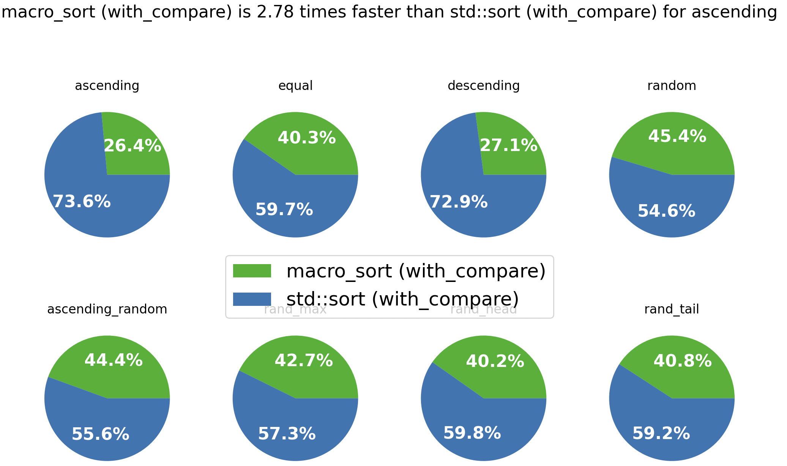

The output from `speed_test`
```
Sorting 1,000,000 items 100 times, each item is 20 bytes

       test name          macro_sort (with_compare)       std::sort (with_compare)           qsort
       ascending                            124.100                        345.294         452.234
           equal                            266.327                        394.359         550.887
      descending                            267.301                        718.980        2545.969
          random                           8163.480                       9829.273       12926.917
ascending_random                           6929.094                       8659.981       11573.819
        rand_max                           2786.566                       3742.983        4169.095
       rand_head                           3687.647                       5481.055        7297.058
       rand_tail                           3397.744                       4923.769        6599.711
```

One reason that macro_sort likely outperforms the std::sort function is because the compare method isn't being inlined since it is being passed as an argument to std::sort.  macro_sort supports creating functions which expect user provided functions.  The test below compares macro_sort with the user function inlined vs being passed as an argument vs std::sort.  There is almost no difference between the two versions of macro_sort in this test.
```bash
./speed_test2 1000000 100
macro-plot.py
macro-plot2.py
```

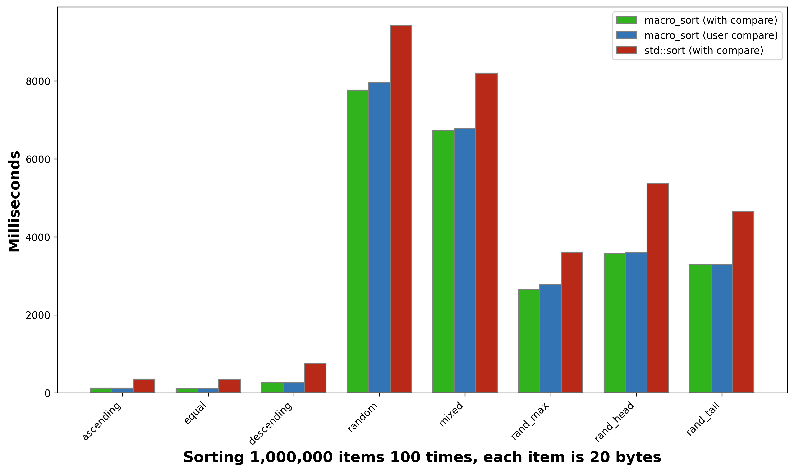
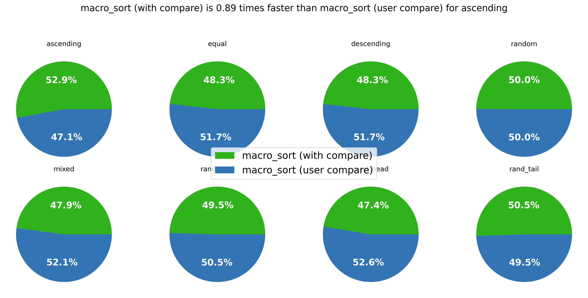

```
Sorting 1,000,000 items 100 times, each item is 20 bytes

       test name          macro_sort (with compare)       macro_sort (user compare)       std::sort (with compare)
       ascending                            125.303                         132.150                        350.112
           equal                            281.692                         283.339                        362.696
      descending                            270.878                         279.437                        756.251
          random                           8417.626                        8432.059                      10164.068
ascending_random                           7039.942                        7175.946                       8886.222
        rand_max                           2827.633                        2823.108                       3808.227
       rand_head                           3762.794                        3738.675                       5657.587
       rand_tail                           3374.678                        3412.348                       4921.894
```

macro_sort with compare inlined vs std::sort with the less operator defined vs a user provided compare function.  The less operator shows significant improvement over the user provided comparison function.  It also slightly outperforms macro_sort on the random measure.  However, macro_sort performs much better for ascending and descending.

```bash
./speed_test_class 1000000 100 
macro-plot.py
macro-plot2.py
```


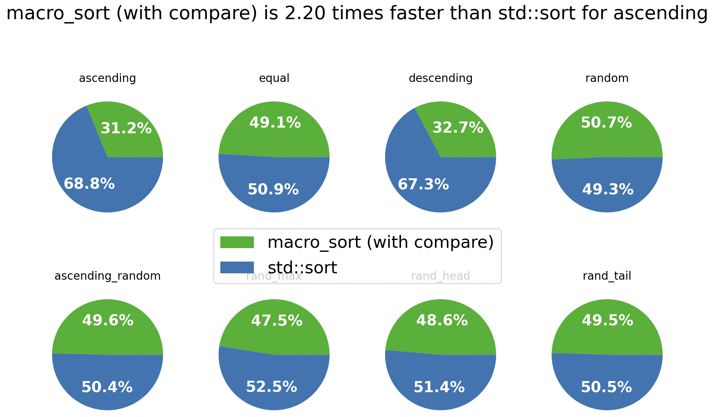
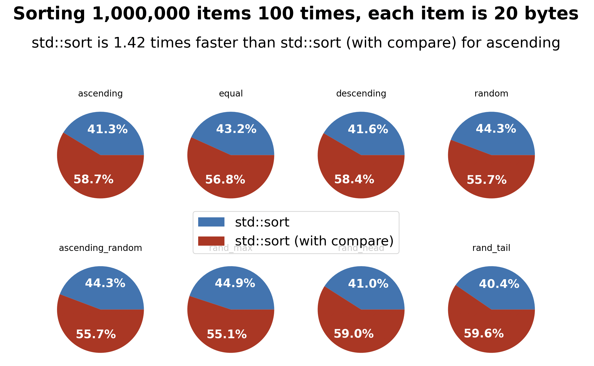


```
Sorting 1,000,000 items 100 times, each item is 20 bytes

       test name          macro_sort (with compare)       std::sort       std::sort (with compare)
       ascending                            125.574         276.332                        392.728
           equal                            267.515         277.585                        364.329
      descending                            270.696         556.046                        781.695
          random                           8312.908        8071.065                      10161.059
ascending_random                           6985.034        7093.619                       8936.456
        rand_max                           2799.808        3093.811                       3792.217
       rand_head                           3751.256        3964.302                       5711.602
       rand_tail                           3352.918        3425.056                       5045.069
```

Comparing macro_sort using the less operator vs the user specified inlined compare function.  There is a very slight improvement in performance.

```bash
./speed_test_class2 1000000 100 
macro-plot.py
macro-plot2.py
```

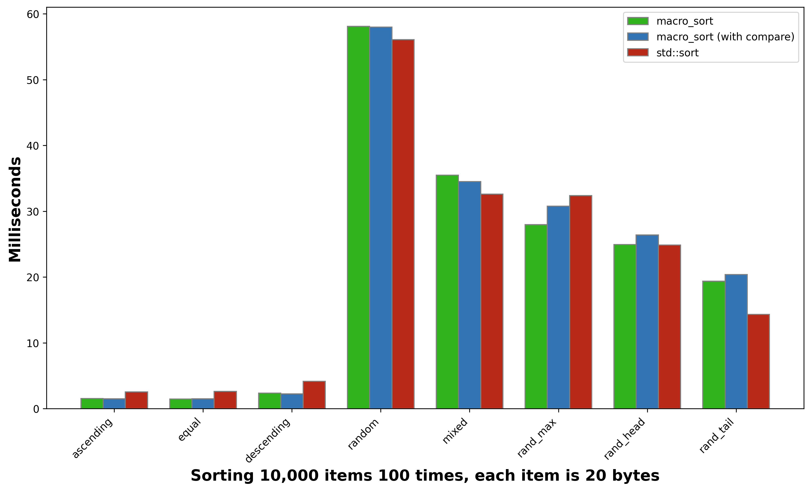
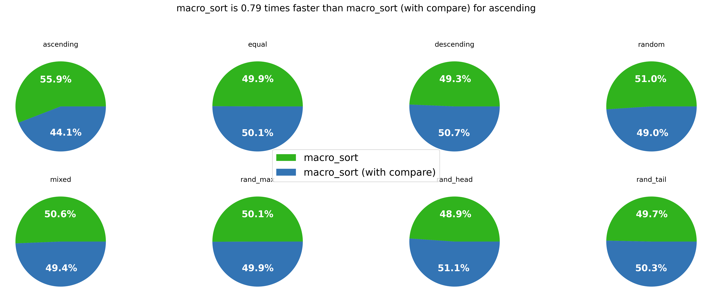
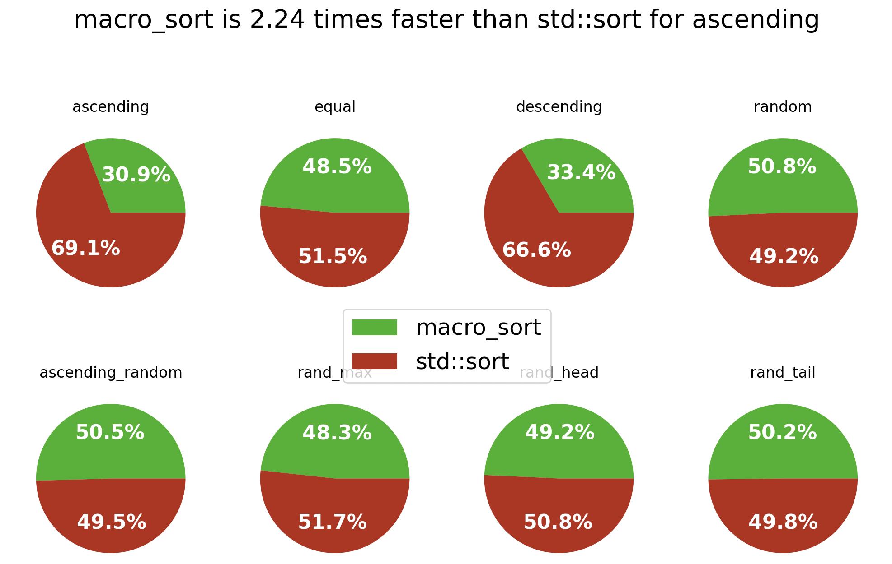

```
Sorting 1,000,000 items 100 times, each item is 20 bytes

       test name          macro_sort      macro_sort (with compare)       std::sort
       ascending             123.947                        125.024         277.621
           equal             262.961                        274.195         279.412
      descending             269.761                        279.707         537.356
          random            8141.267                       8217.977        7894.193
ascending_random            6911.564                       6948.011        6782.404
        rand_max            2760.134                       2745.247        2960.125
       rand_head            3727.606                       3729.694        3841.979
       rand_tail            3416.946                       3404.477        3390.682
```

Finally, the larger the item size, the less the difference between the algorithms.  There is still a notable difference for the ascending and descending cases.

```bash
./speed_test_class3 1000000 100 
macro-plot.py
macro-plot2.py
```

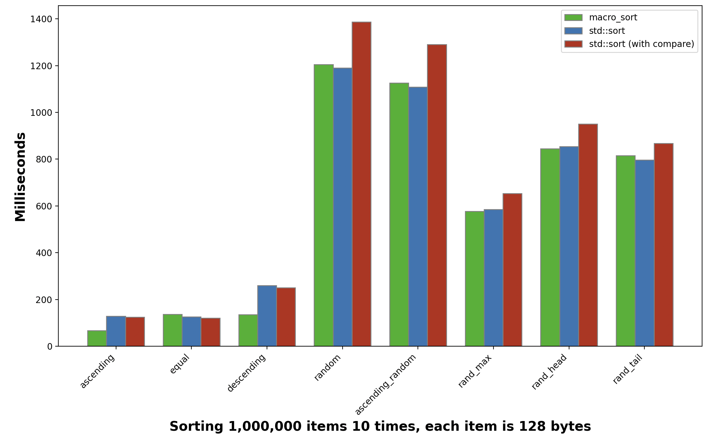
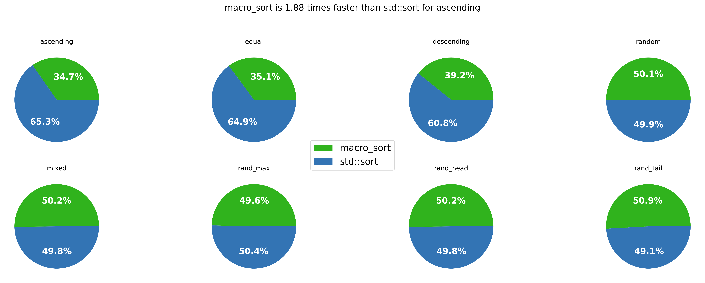
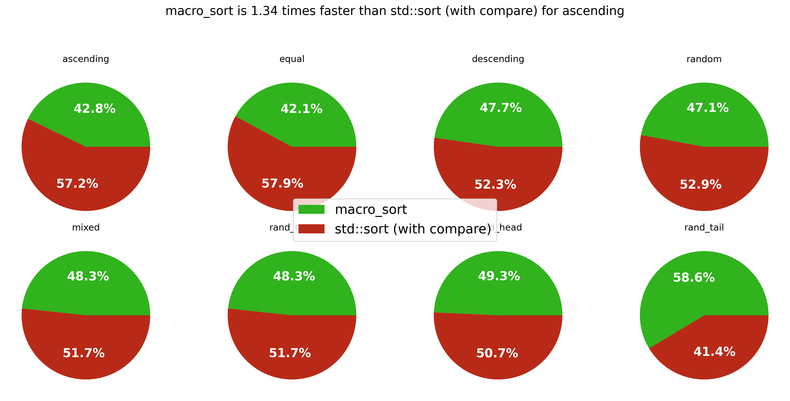

```
Sorting 1,000,000 items 10 times, each item is 128 bytes

       test name          macro_sort      std::sort       std::sort (with compare)
       ascending              66.346        129.161                        124.068
           equal             136.901        126.345                        120.919
      descending             134.923        259.615                        250.875
          random            1205.031       1190.597                       1387.029
ascending_random            1126.265       1108.153                       1290.547
        rand_max             576.988        585.242                        653.625
       rand_head             844.193        854.493                        950.742
       rand_tail             814.720        796.030                        866.865
```
