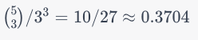

[See in github](https://github.com/contactandyc/the-macro-library/blob/main/PERFORMANCE.md)

`macro_sort` (the macro library's version of sort) is introsort with a twist. In the beginning of the sort, the first, last, and mid points are compared to quickly determine that the array sortedness while choosing a pivot.  More details follow the graphs comparing performance.

# macro_sort performance
A C alternative to qsort that is similar to C++'s std::sort

macro_sort is an improvement over qsort in a few respects.
* It provides type checking similar to C++'s std::sort
* Types and compare functions can be inlined
* Support exists for a wide variety of compare techniques
* 400% faster for ordered cases
* 900% faster for the reverse case
* 170% faster for random cases

It also performs well when stacked up against std::sort
* 230% faster for ordered cases
* 200% faster for the reverse case
* 98.7% (slightly slower) for random cases

macro_sort performs better when compared against std::sort with a dynamically supplied compare function
* 300% faster for ordered cases
* 270% faster for the reverse case
* 130% faster for random cases

The macro library is meant to be easy to use.  See the [README](README.md) for more details

macro_sort vs qsort


macro_sort vs std::sort


macro_sort vs std::sort with a dynamically supplied compare function


# Exploiting the median of 3 pivot selection

The approach that most quick sort implementations choose when implementing the partition portion of the quick-sort algorithm is to use either the median of the first, mid, and last points in an array.  If the set is large enough, then the median of 9 is taken (also known as ninther).  In addition, to implement introsort (invented by [David Musser](https://en.wikipedia.org/wiki/Introsort) in 1997) will begin first by choosing a maxdepth and when the recursion or stack has reached maxdepth, heapsort is chosen instead of quicksort.  The algorithm looks like this

[introsort](https://en.wikipedia.org/wiki/Introsort) - with a bit more detail
```pseudocode
procedure sort(A : array):
    maxdepth ← ⌊log2(length(A))⌋ × 2
    introsort(A, maxdepth)

procedure pivot(A):
    return A[some_point]
    
procedure partition(A, p):
    // place all values that are equal to p in the middle
    // put all values less than p to the left and greater to the right    
    return A[all values < p], A[all values > p]
        
procedure introsort(A, maxdepth):
    n ← length(A)
    if n < 16:
        insertionsort(A)
    else if maxdepth = 0:
        heapsort(A)
    else:
        p ← pivot(A)
        left, right := partition(A, p)
        introsort(left, maxdepth - 1)
        introsort(right, maxdepth - 1)
```

`macro_sort` proposes to do the following at a high level

```pseudocode
procedure sort(A : array):
    if n < 16:
        insertionsort(A)
        return
    p ← checksort(A):
    if not p:
        return    
    maxdepth ← ⌊log2(length(A))⌋ × 2
    left, right := partition(A, p)    
    introsort(left, maxdepth - 1)
    introsort(right, maxdepth - 1)

procedure checksort(A):
    // explained next
    return p

procedure pivot(A):
    return A[some_point]
   
procedure partition(A, p):
    // place all values that are equal to p in the middle
    // put all values less than p to the left and greater to the right    
    return A[all values < p], A[all values > p]

procedure introsort(A, maxdepth):
    n ← length(A)
    if n < 16:
        insertionsort(A)
    else if maxdepth = 0:
        heapsort(A)
    else:
        p ← pivot(A)
        left, right := partition(A, p)
        introsort(left, maxdepth - 1)
        introsort(right, maxdepth - 1)
```

If `checksort` finds the array `A` sorted or all equal, it will conceptually return a _nil_ pivot and the sort is then complete.  If the array is reversed, it will reverse the array and return the _nil_ pivot ending the sort.  Otherwise, it will return the pivot point and continue to partition.  `checksort` is only called once at the beginning of the sort.

Pivot often chooses the median of the lo, mid, and hi values in the array as the pivot.

```pseudocode
procedure pivot(A):
    lo := A
    hi := A + len(A) - 1
    mid := ⌊(lo + hi) / 2⌋
    if A[mid] < A[lo]
        swap A[lo] with A[mid]
    if A[hi] < A[lo]
        swap A[lo] with A[hi]
    if A[mid] < A[hi]
        swap A[mid] with A[hi]
    return A[hi]
```

The idea behind `checksort` is to do this comparison differently.  Initially, compare the lo and hi.  If the `lo <= hi`, then the array is possibly ascending or all equal.  If `lo > hi`, then the array is possibly descending.

```pseudocode
procedure checksort(A):
    lo := A
    hi := A + len(A) - 1
    if A[lo] <= A[hi]:
        // possibly ascending or equal        
    else:
        // possibly descending
```

Next, continue with the first case and check a point `a` between `lo` and `hi`.  

```pseudocode
procedure checksort(A):
    lo := A
    hi := A + len(A) - 1
    if A[lo] <= A[hi]:
        mid := ⌊(lo + hi) / 2⌋
        if A[lo] > A[mid]:
            return A[lo]
        elif A[hi] < A[mid]:
            return A[hi]
        // next: continue checking if sorted
    else:
        // possibly descending
```

If the tests do not get to the `next: continue checking if sorted` comment, the array is not sorted.  Otherwise, continue to check a few more points in between.  For example, consider checking the first, 1/4, 1/2, 3/4, last.

```pseudocode
    delta := (lo + hi) / 4
    a := lo
    if A[a+delta] < A[a]: // if 1/4 < lo), then out of order
        return A[mid]
    a += delta
    if A[a+delta] < A[a]: // if 1/2 < 1/4, then out of order
        return A[mid]
    a += delta
    if A[a+delta] < A[a]: // if 3/4 < 1/2, then out of order
        return A[mid]
    a += delta
    if A[hi] < A[a]:    // if hi < 3/4, then out of order
        return A[mid]
```

At this point, the set is far more likely to be sorted than not, so compare all elements and if all are in order, return _nil_.
```pseudocode
    while lo < hi:
        if A[lo+1] < A[lo]:
            return A[mid]
        lo = lo + 1
    return nil
```

Reverse works in the same way only having everything reversed and at the end, swap all elements using the classic reverse algorithm.

# Understanding the math behind the comparisons and to know how many to choose.

In the pseudocode above, 7 comparisons must be satisfied before testing the whole array.
* lo <= hi
* lo <= mid
* mid <= hi
* lo <= lo+1/4
* 1/4 <= 1/2
* 1/2 <= 3/4
* 3/4 <= hi

One issue that can occur is that after these 7 comparisons, the array could still be out of order.  In this case, it is possible to scan nearly the entire array before recognizing the out of order item.  On the other hand, if too many comparisons are performed in the pre-test, that can also get more expensive.  It is helpful to understand the math behind all of this to inform the decision.

Ideally, one would want to answer the following questions.

* How many possible arrays can be created?
* What is the probability of the array being out of order after N comparisons?
* How does the range of values effect this probability?


## How many possible arrays can be created?
The number of possible arrays is the range^(length of the array).  For example, if the range of each item is 10 (0..9) and the array is 3 in length, then the number of possible arrays is 10^3 or 1,000.

## What is the probability of the array being out of order after N comparisons?

The [binomial coefficient](https://en.wikipedia.org/wiki/Binomial_coefficient) can be used to answer how many possible combinations exist where all items in the array are ordered (less than or equal)


* `n` is the number of different values each item can take.
* `k` is the length of the array.

For example, if the range of each item is 10 (0..9), and the array is 3 in length, then for the top part of the binomial coefficient is n + k - 1 or 10 + 3 - 1 or 12 and the bottom part is k or 3.  This becomes 12 choose 3 which can be evaluated using 

The binomial coefficient can be written as


```
     a!
-------------
b! * (a - b)!
```

or


```
     12!
-------------
3! * (12 - 3)!
```

or 

```
     12!
-------------
    3! * 9!
```

or

```
12 * 11 * 10 * 9!
-----------------
   3! * 9!
```

or 

```
12 * 11 * 10
------------
 3 * 2 * 1
```

or

```
220
```

This means that there are 220 combinations of 3 digits where the `1st digit <= 2nd digit <= 3rd digit`.

To find the number of combinations of 3 digits which are <= + >, double the combination and subtract `n` (or 10).

The number of combinations which are <= or >= 
```
220 + 220 - 10 = 430
```

So with the 3 tests, the probability of being in order or reversed is 430/1000 or 0.43

In the pseudocode above, 7 comparisons are made, so the probability should be ((16 choose 7) * 2 - 10).


```
11440 * 2 - 10 = 22870
```

So with 7 comparisons, the probability is `22,870/10^7` or 0.002287.

The odds of the 7 comparisons all evaluating to true is around 1/5th of a percent if the items being sorted have 10 possible values.  This is why the `checksort` works.  It rapidly determines if the set is not sorted instead of comparing from the beginning to the end to see if it is not.  

## How does the range of values effect this probability?




As the range increases, the final probability approaches 1/6th.  To include the reverse case, double it making it 1/3rd.  The equal case is insignificant.  Hopefully it is clear from the above numbers that it is likely that whatever values are being sorted are going to be close to the limit of the function.

The limit can calculated as 1/k! where k is the number of items in the array.  For example, 3 would be 1/3! or 1/6, 7 would be 1/7! or 0.000198.

## Summary

The likelihood or probability of `k` random items being order (<=) is `1/k!`

If the array being sorted is large, then it makes sense to do a few extra comparisons as each comparison dramatically reduces the odds that an array would `not` be sorted after passing all of them.
