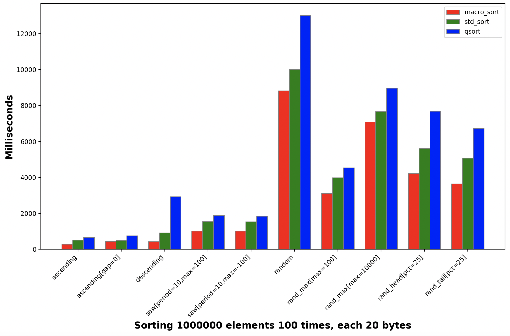

# the-macro-library
The macro_sort performs significantly better than qsort and better than std::sort.  This test was run on a MacBook Pro 2020 2.3 GHz Quad-Core Intel Core i7 with 32 GB 3733 MHz LPDDR4X RAM.



## What's included

`macro_sort.h` - a c approach to sorting

`macro_bsearch.h` - a c approach to searching using various binary search approaches

`macro_map.h` - a c version of the c++ map (or dictionary)

I welcome suggestions and plan to have more soon!

## Installation

```bash
mkdir -p build
cd build
cmake ..
make
make install
```

To use the python utilities

Mac OS X
```bash
python3 -m venv venv
source venv/bin/activate
source .env
pip install -r requirements.txt
```

Linux
```bash
python -m venv venv
source venv/bin/activate
source .env
pip install -r requirements.txt
```

Windows
```bash
python -m venv venv
source `.\venv\Scripts\activate`
pip install -r requirements.txt
```

To leave the virtual environment
```bash
deactivate
```

## Lightweight

This library is entirely header based and requires no special linkage.

## Simple to use

```c
#include "the-macro-library/macro_sort.h"

bool compare_ints(const int *a, const int *b) {
    return *a < *b;
}

macro_sort(sort_ints, int, compare_ints);

int main() {
    int arr[] = { 5, 4, 3, 1, 2 };
    sort_ints(arr, 5);
    ...    
```

## Debuggable

C macros are difficult to debug with most debuggers.  The included `bin/convert-macros-to-code` will convert macros to their base code and preserve readability.  Additionally, the convert tool can be used to create functions which have no dependency on this library.

## Extendable

This library has started with introsort and a series of binary search methods.  Other algorithms are planned to be added soon.

## A Fast C Sort (works fine with C++)
A comparison of this sort to qsort and std::sort follows.

starting from root directory (assuming package was built - see last section)
```bash
cd build/examples/speed-test
./speed_test 1000000 100 
macro-plot.py
```

```
Sorting 1000000 elements 100 times which are of size 20

              test name	  macro_sort	  std_sort	       qsort
              ascending	  294.351000	528.314000	  677.732000
       ascending[gap=0]	  448.574000	508.835000	  761.455000
             descending	  443.424000	923.441000	 2902.537000
 saw[period=10,max=100]	 1027.698000   1555.817000	 1894.363000
saw[period=10,max=-100]	 1051.246000   1540.264000	 1865.106000
                 random	 8750.826000  10468.536000	13477.098000
      rand_max[max=100]	 3119.780000   4015.032000	 4593.354000
    rand_max[max=10000]	 6738.275000   7613.115000	 9240.308000
      rand_head[pct=25]	 4186.926000   5770.527000	 8037.935000
      rand_tail[pct=25]	 3681.935000   5453.779000	 6964.615000
```

Across nearly all measures for the given test, the macro library performs better than std::sort and significantly better than qsort.  I've found that for raw types, the std::sort tends to perform about the same as the macro versions.

See examples/speed-test/speed_test.cc and feel free to modify the test. 

## The macro sort is the introsort + a sort check at the beginning.

The sort check at the beginning considers the first and last element of the array and then expects the middle element to be between them.  If the middle element is not between them, the introsort continues.  Otherwise, two conditions remain.  The first is that the first element is less than or equal to the last element.  In this case a few additional elements are compared to further check that the array is sorted.  If any of those checks fail, the introsort loop is continued.  Otherwise, the array is checked from the beginning to the end and if it is entirely sorted, the sort is finished.  If the first element is greater than the last element, then the same comparisions continue in reverse. Once the array is determined to be completely reversed, all elements are swapped.

## A simple example

examples/demo/sort_ints.c
```c
#include "the-macro-library/macro_sort.h"

bool compare_ints(const int *a, const int *b) {
    return *a < *b;
}

macro_sort(sort_ints, int, compare_ints);

int main() {
    int arr[] = { 5, 4, 3, 1, 2 };
    sort_ints(arr, sizeof(arr)/sizeof(arr[0]));
    for( int i=0; i<sizeof(arr)/sizeof(arr[0]); i++ )
        printf(" %d", arr[i] );
    printf( "\n");
    return 0;
}
```

```bash
$ gcc examples/demo/sort_ints.c -o sort_ints -O3
$ ./sort_ints
 1 2 3 4 5
```

## `_macro_sort( name, comparison_style, type, compare_function )`

The default macro_sort function is a less function which takes no arguments.  The `_macro_sort` method allows for custom comparisons.  In general, the macro library's approach is to define a customizable underscore prefixed macro and a default macro without the underscores with a common value.

The `macro_cmp.h` file defines a series of comparison_style(s) which are listed below.  If a new style is added to this file, it should allow for the other algorithms to take advantage of it without change!

| Suffix      | Comparison Type                                                            |
|-------------|----------------------------------------------------------------------------|
| cmp_no_arg  | int compare(const type *a, const type *b);                                 |
| cmp_arg     | int compare(const type *a, const type *b, void *arg);                      |
| arg_cmp     | int compare(void *arg, const type *a, const type *b);                      |
| less_no_arg | bool less(const type *a, const type *b);                                   |
| less_arg    | bool less(const type *a, const type *b, void *arg);                        |
| arg_less    | bool less(void *arg, const type *a, const type *b);                        |
| less        | no comparison, expects *(a) < *(b) to function                             |
| cmp         | no comparison, expects *(a) < *(b), *(a) <= *(b), *(a) == *(b) to function |

## Making the functions static and/or static inline

To make the sort function `static` or `static inline`, add it in the line before the macro_sort call.

```c
static
macro_sort(sort_ints, int, compare_int);
```

OR

```c
static inline
macro_sort(sort_ints, int, compare_int);
```

## User specified compare functions

`macro_sort` has a `macro_sort_compare` counterpart which defines a sort function that allows for user specified compare functions.  This xxx_compare function does not require a compare method to be passed to it.

```c
macro_sort_compare(sort_ints, int);

bool compare_ints(const int *a, const int *b) {
    return *a < *b;
}
```

## Creating header file definitions

For each macro, there is a corresponding _h macro, (`macro_sort` => `macro_sort_h`).

some_header.h
```c
macro_sort_compare_h(sort_ints, int);
```

For headers, it is important to add the semicolon.  This produces ...

```c
void sort_ints(int *base, size_t n,
          bool (*cmp)(const int *a, const int *b));
```

Use `static` or other modifiers on the line before if needed.

```c
static inline
macro_sort_compare_h(sort_ints, int);
```

produces

```c
static inline
void sort_ints(int *base, size_t n,
          bool (*cmp)(const int *a, const int *b));
```


## Converting define macros into code

`#define` is a very useful mechanism in C/C++.  However, these statements present challenges during debugging since debuggers won't typically let you step through a macro.  This library helps to address this with the `bin/convert-macros-to-code` script.  The tool will read a source file and replace any macro_...() define statements with their underlying code.

Consider examples/demo/sort_ints.c
```c
#include "the-macro-library/macro_sort.h"

bool compare_ints(const int *a, const int *b) {
    return *a < *b;
}

macro_sort(sort_ints, int, compare_ints);

int main() {
...
```

```bash
$ convert-macros-to-code examples/demo/sort_ints.c | less
...
bool compare_ints(const int *a, const int *b) {
    return *a < *b;
}

void sort_ints(int *base,
          size_t n) {
    int *a, *b, *e;
    int tmp;
    if(n < 17) {
        e = base + n;
        a = base + 1;
        while (a < e) {
            tmp = *a;
            b = a;
...
```

Instead of printing to the terminal, the output can be redirected to a file and compiled.
```bash
$ convert-macros-to-code examples/demo/sort_ints.c > sort_ints_d.c
$ g++ sort_ints_d.cc -o sort_ints_d -g
$ ./sort_ints_d
 1 2 3 4 5
```

Because the macros are expanded, this new program is easy to debug.

# Binary Search

```c
#include "the-macro-library/macro_bsearch.h"

static inline
int compare_int(const int *a, const int *b) {
    return *a - *b;
}

macro_bsearch(bsearch_ints, int, compare_int)
macro_bsearch_first(bsearch_first_ints, int, compare_int)
macro_bsearch_last(bsearch_last_ints, int, compare_int)
macro_bsearch_floor(bsearch_floor_ints, int, compare_int)
macro_bsearch_ceiling(bsearch_ceiling_ints, int, compare_int)
macro_bsearch_lower_bound(bsearch_lower_bound_ints, int, compare_int)
macro_bsearch_upper_bound(bsearch_upper_bound_ints, int, compare_int)
```

This produces the core binary search function `bsearch_ints` and the `first`, `last`, `floor`, `ceiling`, `lower_bound`, and `upper_bound` functions.

```c
macro_bsearch_h(bsearch_ints, int, compare_int);
```

produces

```c
int *bsearch_ints(const int *key, const int *base, size_t n);
```

and it can be used like

```c
    int arr[] = { 1, 3, 3, 5 };
    int key = 3;
    int *r = bsearch(&key, arr, n);
    if(r) // key is found and points to one of the 3s
```

There is also a `macro_bsearch_kv` macro which allows the comparison function to have a different type for the key than that of the array.

# The Set or Map
An implementation of the red black tree using macros and inlined code.

Documentation coming soon.

See `macro_map.h` and `examples/demo/map_ints.c`

## A quick refresher on what each bsearch function does (and roughly the map functions)

Consider the following array

1, 3, 3, 5

### core (the common bsearch method)
Finds any instance of a key or return NULL if none exist.

| key | response | index                    | reason                                  |
|-----| --- |--------------------------|-----------------------------------------|
| 0   | NULL | none | 0 is not in the array                   |
| 1   | 1 | 0 | 1 is found in the first index           |
| 2   | NULL | none | 2 is not in the array                   |
| 3   | 3 | 1 or 2 | it is valid for either 3 to be returned |
| 4   | NULL | none | 4 is not in the array                   |
| 5   | 5 | 3 | 5 is found in the last index            |
| 6   | NULL | none | 6 is not in the array                   |

### first
Finds the first instance of a key or return NULL if none exist.

| key | response | index | reason                                           |
|-----| --- |---|--------------------------------------------------|
| 0   | NULL | none | 0 is not in the array                            |
| 1   | 1 | 0 | 1 is found in the first index                    |
| 2   | NULL | none | 2 is not in the array                            |
| 3   | 3 | 1 | The 3 in the 2nd slot is the first instance of 3 |
| 4   | NULL | none | 4 is not in the array                            |
| 5   | 5 | 3 | 5 is found in the last index                     |
| 6   | NULL | none | 6 is not in the array                            |

### last
Finds the last instance of a key or return NULL if none exist.

| key | response | index | reason                                          |
|-----| --- |-------|-------------------------------------------------|
| 0   | NULL | none  | 0 is not in the array                           |
| 1   | 1 | 0     | 1 is found in the first index                   |
| 2   | NULL | none  | 2 is not in the array                           |
| 3   | 3 | 2     | The 3 in the 3rd slot is the last instance of 3 |
| 4   | NULL | none  | 4 is not in the array                           |
| 5   | 5 | 3     | 5 is found in the last index                    |
| 6   | NULL | none  | 6 is not in the array                           |

### floor
Finds the first instance of a key or the value less than.  NULL is returned if the key is less than any item in the array.

| key | response | index | reason                                         |
|-----|----------|-------|------------------------------------------------|
| 0   | NULL     | none  | 0 is less than any value in the array          |
| 1   | 1        | 0     | 1 is found, see bsearch_first                  |
| 2   | 2        | 0     | 2 is not in the array, 1 is less               |
| 3   | 3        | 1     | 3 is found, see bsearch_first                  |
| 4   | 3        | 2     | 4 is not found, the last 3 is less             |
| 5   | 5        | 3     | 5 is found, see bsearch_first                  |
| 6   | 5        | 3     | 6 is not found, the last 5 is less |

### ceiling
Finds the last instance of a key or the value less than.  NULL is returned if the key is less than any item in the array.

| key | response | index | reason                                        |
|-----| ---|-------|-----------------------------------------------|
| 0   | NULL     | none  | 0 is less than any value in the array         |
| 1   | 1        | 0     | 1 is found, see bsearch_last                  |
| 2   | 2        | 0     | 2 is less than 3 in the 2nd slot, returning 1 |
| 3   | 3        | 2     | 3 is found, see bsearch_last                  |
| 4   | 3        | 2     | 4 is less than 5 in the 4th slot, returning 3 |
| 5   | 5        | 3     | 5 is found, see bsearch_last                  |
| 6   | 5        | 3     | 6 is greater than all items, return last one  |

### lower_bound
Finds the first instance of a key or the value greater.  NULL is returned if the key is greater than any item in the array.

| key | response | index | reason                                                  |
|-----|----------|-------|---------------------------------------------------------|
| 0   | 1        | 0     | 0 is less than any value in the array, return 1st value |
| 1   | 1        | 0     | 1 is found, see bsearch_first                           |
| 2   | 3        | 1     | 3 is the greater value than 2                           |
| 3   | 3        | 1     | 3 is found, see bsearch_first                           |
| 4   | 5        | 3     | 5 is the greater value than 4                           |
| 5   | 5        | 3     | 5 is found, see bsearch_first                           |
| 6   | NULL     | none  | 6 is greater than all items, return NULL                |

### upper_bound
This is different than the others in that the response is always one greater than the key.  It is possible for this to extend beyond the array.  The purpose of upper_bound is to be used in conjunction with lower_bound to form a range.

| key | response  | index | reason                                                  |
|-----|-----------|-------|---------------------------------------------------------|
| 0   | 1         | 0     | 0 is less than any value in the array, return 1st value |
| 1   | 3         | 1     | 1 is found, return next value (3)                       |
| 2   | 3         | 1     | 2 is greater than 1, return next value (3)              |
| 3   | 5         | 3     | 3 is found, return next value (5)                       |
| 4   | 5         | 3     | 4 is greater than 3, return next value (5)              |
| 5   | undefined | 4     | 5 is found, return past array                           |
| 6   | undefined | 4     | 6 is greater than all items, return past array          |

See examples/demo/search_ints.c 

## More to come soon

Contact me at contactandyc@gmail.com