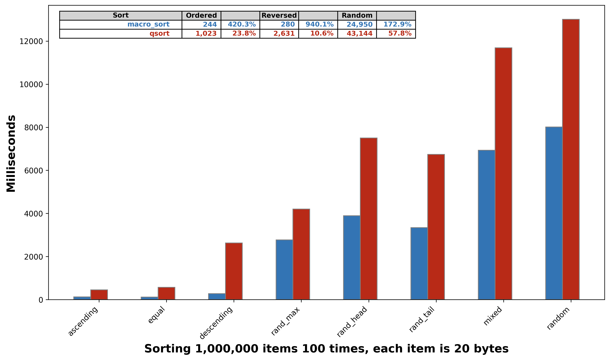
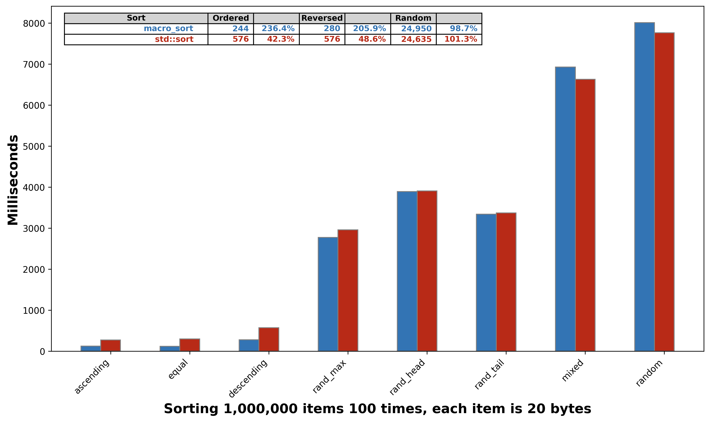
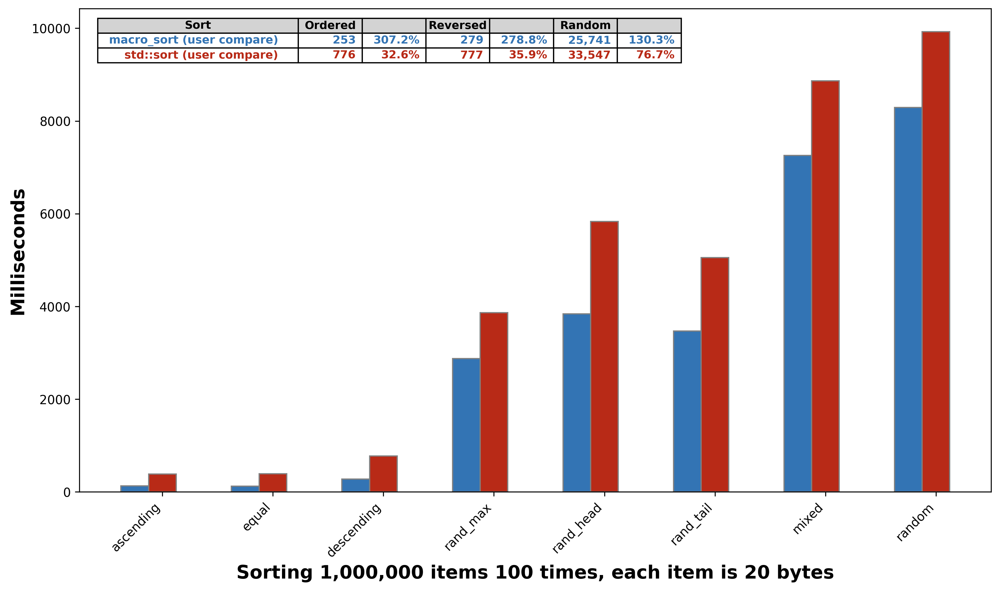

# The Macro Library

**Header‑only, zero‑allocation building blocks for high‑performance C.**
Generate type‑safe, inlined algorithms without dragging in a runtime or templates. Pick a comparator *style* once (via `macro_cmp.h`), then stamp out fast, specialized functions for your types.

* **Sort**: `macro_sort` — inlined **introsort** with early “array shape” checks
* **Search**: `macro_bsearch` — binary search family (`first/last/lb/ub/floor/ceiling`)
* **Map**: `macro_map` — intrusive red–black tree maps & multimaps
* **Heap**: `macro_heap` — min/max heaps over your arrays
* **Test & utils**: tiny test harness, time, conversions, bit ops

---

## Why this library?

* **Speed without ceremony.** Functions are **generated** for your element type and comparator. The compiler inlines everything; no function‑pointer calls in hot loops.
* **Small & portable.** Pure headers. No linker tricks. Works in C (and C++ via `extern "C"`).
* **One comparator model.** `macro_cmp.h` standardizes signatures (`less_*`, `cmp_*`, with or without context), so sort/search/map/heap agree on how to compare.

---

## What’s included (at a glance)

| Component             | What it is                                                                                                   | Use it for                                 |
| --------------------- | ------------------------------------------------------------------------------------------------------------ | ------------------------------------------ |
| **`macro_sort.h`**    | Type‑safe **introsort** (quicksort + heapsort fallback), with a fast path for already‑sorted/reversed inputs | Replace `qsort` and most hand‑rolled sorts |
| **`macro_bsearch.h`** | Generated binary searchers (value–value and KV) with **first/last/lower/upper/floor/ceiling**                | Lookups on sorted arrays                   |
| **`macro_map.h`**     | **Intrusive** red–black tree map/multimap                                                                    | Log‑time inserts/finds without allocations |
| **`macro_heap.h`**    | Min/max heap operations on your buffer                                                                       | Top‑k, priority queues, schedulers         |
| **`macro_cmp.h`**     | Comparator **style** helpers & signatures                                                                    | Bake a comparator or pass one at call‑time |
| **`macro_test.h`**    | Zero‑dep test harness                                                                                        | Tiny unit tests with colored PASS/FAIL     |
| **`macro_time.h`**    | Monotonic timing (ns)                                                                                        | Micro‑benchmarks & timeouts                |
| **`macro_to.h`**      | Time formatting, string→number, bit ops                                                                      | Small utilities you always need            |

**Docs:**

* [README.macro\_sort.md](README.macro_sort.md)
* [README.macro\_bsearch.md](README.macro_bsearch.md)
* [README.macro\_map.md](README.macro_map.md)
* [README.macro\_cmp.md](README.macro_cmp.md)
* [README.macro\_heap.md](README.macro_heap.md)
* [README.macro\_test.md](README.macro_test.md)
* [README.macro\_time.md](README.macro_time.md)
* [README.macro\_to.md](README.macro_to.md)

---

## Algorithmic highlights (why `macro_sort` is fast)

`macro_sort` is introsort **with two key tweaks**:

1. **Early “array shape” check.** Before partitioning, it probes first/middle/last (and a few neighbors) to detect **already sorted** or **fully reversed** inputs.

    * Sorted → **linear verification** and return
    * Reversed → **linear reverse** and return
2. **Comparator inlining.** Your `less`/`cmp` is compiled into the call site; no indirect calls, better branch prediction.

Plus the usual wins: median‑of‑three–style pivoting, tiny partitions via insertion sort, and a heapsort fallback to guarantee `O(n log n)`.

---

## Performance (kept from the original README)

**macro\_sort vs `qsort`**


**macro\_sort vs `std::sort`**


**macro\_sort vs `std::sort` (dynamic comparator)**


Results show large wins on ordered and reversed inputs, and strong performance on random data—especially when the C++ path can’t inline the comparator.

---

## Quick starts

### Sort (baked comparator)

```c
#include "the-macro-library/macro_sort.h"

static inline bool int_less(const int *a, const int *b) { return *a < *b; }
macro_sort(sort_ints, int, int_less);   // -> void sort_ints(int *base, size_t n);

int a[] = {5,4,3,1,2};
sort_ints(a, sizeof a / sizeof a[0]);
```

### Binary search (KV)

```c
#include "the-macro-library/macro_bsearch.h"

typedef struct { int key, payload; } Item;
static int kv_cmp(const int *k, const Item *v){ return (*k > v->key) - (*k < v->key); }

macro_bsearch_lower_bound_kv(item_lb, int, Item, kv_cmp);

Item arr[] = { {1,10}, {3,30}, {3,31}, {8,80} };
int k = 3;
Item *lb = item_lb(&k, arr, sizeof arr/sizeof arr[0]);
```

### Intrusive map (red–black tree)

```c
#include "the-macro-library/macro_map.h"
typedef struct Node { macro_map_t link; int key, val; } Node;

static int node_cmp(const Node *a, const Node *b) { return (a->key > b->key) - (a->key < b->key); }
static int kv_cmp  (const int  *k, const Node *n) { return (*k > n->key)  - (*k < n->key); }

macro_map_insert        (map_insert,      Node, node_cmp);
macro_map_find_kv       (map_find_by_key, int,  Node, kv_cmp);

macro_map_t *root = NULL;
Node n = {.key=42,.val=7};
map_insert(&root, &n);
int k=42; Node *hit = map_find_by_key(root, &k);
```

More examples live in `examples/` and each module’s README.

---

## Installation

This library is **header‑only**; you can vendor the headers and include them.

For convenience (examples, tests, tools):

### Dependencies

* [A cmake library](https://github.com/knode-ai-open-source/a-cmake-library) for the CMake build

### Build

```bash
git clone https://github.com/andycurtis-public/the-macro-library.git
cd the-macro-library

mkdir -p build && cd build
cmake ..
make            # builds examples and tools
# optional:
make install
```

---

## Debugging macros (stepping through code)

Macros don’t step nicely in a debugger. Use the included script to **materialize** generated code:

```bash
bin/convert-macros-to-code examples/demo/sort_ints.c > sort_ints_expanded.c
# compile & debug the expanded C file
```

This preserves readability and removes the dependency on the headers for that TU.

---

## Design notes

* **Header‑only:** drop into any C project; no runtime library to link.
* **Type‑safe generation:** you name the function and type; the macro emits a real symbol with a concrete signature.
* **Comparator styles:** shared across sort/search/map/heap. Choose once (`less_no_arg`, `cmp_no_arg`, `*_arg`, `arg_*`, operator styles) and reuse everywhere. See [README.macro\_cmp.md](README.macro_cmp.md).

---

## License

SPDX-License-Identifier: Apache-2.0
© 2019–2025 Andy Curtis, © 2024–2025 Knode.ai

If something feels rough or surprising, open an issue or read the single headers — they’re meant to be understood.
